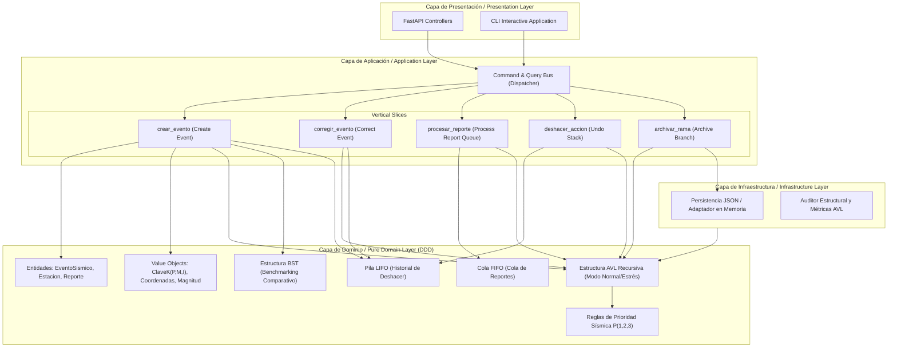

# 🏛️ Documento de Arquitectura / Architecture Specification Document
## Sistema Backend SismoLab AVL - Universidad de Caldas

---

### 1. Resumen Ejecutivo / Executive Summary

**Español:**
Este documento define la arquitectura de software para el backend del sistema **SismoLab AVL**, desarrollado para la Universidad de Caldas. El sistema está diseñado para la gestión en tiempo real, priorización y análisis estructural de eventos sísmicos mediante árboles AVL recursivos de alto rendimiento ordenados por la clave compuesta $K = (P, M, I)$ (Prioridad, Magnitud, Identificador).

La solución se estructura mediante:
- **Domain-Driven Design (DDD)** para el aislamiento estricto del modelo de negocio.
- **Vertical Slicing** (Cortes Verticales) para encapsular cada caso de uso sin acoplamiento horizontal.
- **Clean Architecture / Onion Layering** separando Presentación, Aplicación, Dominio e Infraestructura.
- **Bus de Servicios (Command / Event Bus)** en Python nativo para el desacoplamiento de mensajes.
- **Modos de Operación AVL**: Modo Normal (auto-balanceo recursivo inmediato) y Modo Estrés (inserción masiva acelerada con balanceo diferido).

**English:**
This document defines the software architecture for the **SismoLab AVL** backend system, developed for the Universidad de Caldas. The system is designed for real-time management, prioritization, and structural analysis of seismic events using high-performance recursive AVL trees ordered by the composite key $K = (P, M, I)$ (Priority, Magnitude, Identifier).

The solution is structured using:
- **Domain-Driven Design (DDD)** for strict business model isolation.
- **Vertical Slicing** to encapsulate each use case without horizontal coupling.
- **Clean Architecture / Onion Layering** separating Presentation, Application, Domain, and Infrastructure.
- **Service Bus (Command / Event Bus)** in native Python for message decoupling.
- **AVL Operating Modes**: Normal Mode (immediate recursive auto-balancing) and Stress Mode (accelerated massive insertion with deferred balancing).

---

### 2. Diagrama de Componentes (Mermaid) / Component Diagram

---

### 3. Registros de Decisiones de Arquitectura (ADR) / Architecture Decision Records

#### ADR-001: Adopción de Vertical Slicing combinado con DDD
- **Estatus / Status:** Aprobado / Approved
- **Contexto / Context:** Tradicionalmente, los proyectos backend se dividen en capas horizontales monolíticas (`controllers/`, `services/`, `repositories/`), lo que genera controladores masivos y servicios anémicos.
- **Decisión / Decision:** Organizar la lógica de aplicación en cortes verticales independientes (`src/features/`). Cada slice incluye su propio comando, handler, DTO y lógica de coordinación.
- **Consecuencias / Consequences:**
  - *Positivas:* Alta cohesión, bajo acoplamiento. Eliminar un slice no rompe otros módulos.
  - *Negativas:* Ligero incremento en la cantidad de archivos pequeños.

#### ADR-002: Clave Compuesta $K = (P, M, I)$ y Criterio de Balanceo AVL
- **Estatus / Status:** Aprobado / Approved
- **Contexto / Context:** Los sismos deben organizarse por prioridad y severidad. Un sismo de mayor prioridad o mayor magnitud debe situarse en posiciones preferentes del árbol.
- **Decisión / Decision:** Definir la tupla $K = (P, M, I)$ donde:
  - $P \in \{1, 2, 3\}$: Prioridad (1=Alta, 2=Media, 3=Baja).
  - $M \in [-2.0, 10.0]$: Magnitud en escala Richter/Momentum.
  - $I \in [1, 999999]$: Identificador único inmutable `SIS-XXXXXX`.
  - Regla de Ordenamiento: $K_1 < K_2 \iff (P_1 < P_2) \lor (P_1 = P_2 \land M_1 > M_2) \lor (P_1 = P_2 \land M_1 = M_2 \land I_1 < I_2)$.
- **Consecuencias / Consequences:** Permite recorridos en-orden que extraen los eventos sísmicos en orden estricto de criticidad operacional.

#### ADR-003: Modos de Operación AVL (Normal vs. Estrés)
- **Estatus / Status:** Aprobado / Approved
- **Contexto / Context:** Durante emergencias telúricas de gran escala, se reciben miles de eventos en segundos. Realizar rotaciones recursivas continuas $O(\log N)$ por inserción en tiempo real puede causar latencia acumulada.
- **Decisión / Decision:** Implementar dos modos operacionales:
  1. **Modo Normal:** Auto-balanceo recursivo inmediato (rotaciones LL, RR, LR, RL) manteniendo $|FB| \le 1$.
  2. **Modo Estrés:** Inserción rápida estilo BST registrando los nodos desbalanceados en una cola de auditoría para balanceo diferido post-crisis.
- **Consecuencias / Consequences:** Rendimiento óptimo en escenarios de alta carga y garantía de balance estricto en operación normal.

---

### 4. Principios de Diseño y Código Limpio / Clean Code Principles

1. **SOLID:**
   - **Single Responsibility (SRP):** Cada clase (Nodo, Árbol, Handler, ValueObject) tiene una única razón para cambiar.
   - **Open/Closed (OCP):** Las reglas de prioridad se pueden extender implementando nuevos estimadores sin modificar la estructura del AVL.
   - **Liskov Substitution (LSP):** `ArbolAVL` reutiliza contratos de navegación comparables de `ArbolBST`.
   - **Interface Segregation (ISP):** Interfaces del CommandBus especifican únicamente los métodos `handle(command)`.
   - **Dependency Inversion (DIP):** Los casos de uso dependen de abstracciones de repositorios, no de implementaciones físicas JSON o memoria.
2. **Cero SDKs Comerciales (Zero Commercial SDKs):** Todo el núcleo está construido sobre estructuras de datos nativas en Python puro sin dependencias de terceros para el almacenamiento o procesamiento del árbol.
