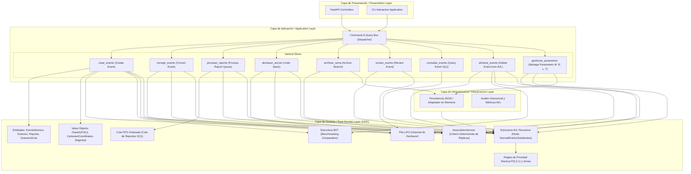

# 🏛️ Documento de Arquitectura / Architecture Specification Document
## Sistema Backend SismoLab AVL - Universidad de Caldas

---

### 1. Resumen Ejecutivo / Executive Summary

**Español:**
Este documento define la arquitectura de software para el backend del sistema **SismoLab AVL**, desarrollado para la Universidad de Caldas. El sistema está diseñado para la gestión en tiempo real, priorización y análisis estructural de eventos sísmicos mediante árboles AVL recursivos de alto rendimiento ordenados por la clave compuesta $K = (P, M, I)$ (Prioridad, Magnitud, Identificador).

La solución se estructura mediante:
- **Domain-Driven Design (DDD)** para el aislamiento estricto del modelo de negocio.
- **Vertical Slicing** (Cortes Verticales) para encapsular cada caso de uso sin acoplamiento horizontal.
- **Clean Architecture / Onion Layering** separando Presentación, Aplicación, Dominio e Infraestructura.
- **Bus de Servicios (Command / Event Bus)** en Python nativo para el desacoplamiento de mensajes.
- **Modos de Operación AVL**: Modo Normal (auto-balanceo recursivo inmediato) y Modo Estrés (inserción masiva acelerada con balanceo diferido).

**English:**
This document defines the software architecture for the **SismoLab AVL** backend system, developed for the Universidad de Caldas. The system is designed for real-time management, prioritization, and structural analysis of seismic events using high-performance recursive AVL trees ordered by the composite key $K = (P, M, I)$ (Priority, Magnitude, Identifier).

The solution is structured using:
- **Domain-Driven Design (DDD)** for strict business model isolation.
- **Vertical Slicing** to encapsulate each use case without horizontal coupling.
- **Clean Architecture / Onion Layering** separating Presentation, Application, Domain, and Infrastructure.
- **Service Bus (Command / Event Bus)** in native Python for message decoupling.
- **AVL Operating Modes**: Normal Mode (immediate recursive auto-balancing) and Stress Mode (accelerated massive insertion with deferred balancing).

---

### 2. Diagrama de Componentes (Mermaid) / Component Diagram

---

### 3. Registros de Decisiones de Arquitectura (ADR) / Architecture Decision Records

#### ADR-001: Adopción de Vertical Slicing combinado con DDD
- **Estatus / Status:** Aprobado / Approved
- **Contexto / Context:** Tradicionalmente, los proyectos backend se dividen en capas horizontales monolíticas (`controllers/`, `services/`, `repositories/`), lo que genera controladores masivos y servicios anémicos.
- **Decisión / Decision:** Organizar la lógica de aplicación en cortes verticales independientes (`src/features/`). Cada slice incluye su propio comando, handler, DTO y lógica de coordinación.
- **Consecuencias / Consequences:**
  - *Positivas:* Alta cohesión, bajo acoplamiento. Eliminar un slice no rompe otros módulos.
  - *Negativas:* Ligero incremento en la cantidad de archivos pequeños.

#### ADR-002: Clave Compuesta $K = (P, M, I)$ y Criterio de Balanceo AVL
- **Estatus / Status:** Aprobado / Approved
- **Contexto / Context:** Los sismos deben organizarse por prioridad y severidad según las especificaciones de las Secciones 3 y 4 del proyecto.
- **Decisión / Decision:** Definir la tupla $K = (P, M, I)$ donde:
  - $P \in \{1, 2, 3\}$: Prioridad obligatoria de acuerdo con la Sección 4:
    - **3 (Alta):** $M \ge 6.0$; o ($M \ge 4.5 \land H \le 30.0\text{ km} \land \text{zona\_poblada}$).
    - **2 (Media):** No es alta y $M \ge 4.5$.
    - **1 (Baja):** Todos los demás casos.
  - $M \in [-2.0, 10.0]$: Magnitud decimal con máximo un decimal.
  - $I \in [1, 999999]$: Identificador numérico único inmutable (ej. `SIS-000010`), comparado numéricamente.
  - Regla de Ordenamiento Lexicográfica de Tres Niveles:
    $$K_1 < K_2 \iff (P_1 < P_2) \lor (P_1 = P_2 \land M_1 < M_2) \lor (P_1 = P_2 \land M_1 = M_2 \land I_1 < I_2)$$
  - Estructura Auxiliar de Búsqueda $O(1)$: Para desacoplar el ordenamiento por prioridades del AVL de la necesidad operativa de consultar eventos por su identificador único sin incurrir en búsquedas exhaustivas $O(N)$, el árbol implementa `self.indice_por_id = { id_entero: referencia_al_nodo_avl }`, garantizando acceso instantáneo $O(1)$ con sincronización inmutable ante inserción, eliminación y balanceo.
  - Alternativas descartadas:
    - *Segundo árbol AVL ordenado por ID:* Descartado por duplicación de consumo de memoria y sobrecosto de balancear dos árboles en cada operación mutadora ($2 \times O(\log N)$).
    - *Recorrido exhaustivo secuencial $O(N)$:* Descartado por degradación lineal inaceptable ante catálogos con alta densidad sísmica.
- **Consecuencias / Consequences:** Permite recorridos en-orden que extraen los eventos sísmicos en orden estricto de criticidad operacional y resolución de búsquedas por ID en tiempo constante $O(1)$.

#### ADR-003: Modos de Operación AVL (Normal vs. Estrés)
- **Estatus / Status:** Aprobado / Approved
- **Contexto / Context:** Durante emergencias telúricas de gran escala, se reciben miles de eventos en segundos. Realizar rotaciones recursivas continuas $O(\log N)$ por inserción en tiempo real puede causar latencia acumulada.
- **Decisión / Decision:** Implementar dos modos operacionales:
  1. **Modo Normal:** Auto-balanceo recursivo inmediato (rotaciones LL, RR, LR, RL) manteniendo $|FB| \le 1$.
  2. **Modo Estrés:** Inserción rápida estilo BST registrando los nodos desbalanceados en una cola de auditoría para balanceo diferido post-crisis.
- **Consecuencias / Consequences:** Rendimiento óptimo en escenarios de alta carga y garantía de balance estricto en operación normal.

#### ADR-004: Arquitectura de Interfaz de Usuario en Tres Bloques Funcionales Desacoplados
- **Estatus / Status:** Aprobado / Approved
- **Contexto / Context:** En interfaces de monitoreo de estructuras de datos en tiempo real, disponer todos los controles en una sola línea continua satura la atención visual y desordena la jerarquía operativa.
- **Decisión / Decision:** Dividir la barra superior en tres cápsulas flotantes independientes sin emojis (solo iconos SVG limpios):
  1. **Bloque Izquierdo:** Identidad y Estado Operativo (Logo + Sello, Estado NORMAL/ESTRÉS, Alturas AVL/BST).
  2. **Bloque Central:** Dimensión Temporal y Filtros (Reloj UTC + Sincronización, Selector de Vista Dual/AVL/BST, Barra de Búsqueda Global).
  3. **Bloque Derecho:** Acciones Críticas de Ingesta (Deshacer LIFO, Sismos Predefinidos, + Nuevo Sismo).
- **Consecuencias / Consequences:** Mayor claridad cognitiva, área central de visualización del árbol 100% despejada y navegación intuitiva.

#### ADR-005: Representación de Nodos, Pila LIFO y Cola FIFO Enlazada
- **Estatus / Status:** Aprobado / Approved
- **Contexto / Context:** Se requiere seleccionar la representación física de los nodos de los árboles, la pila de deshacer y la cola de telemetría sin emplear librerías externas de colecciones ordenadas ni estructuras opacas.
- **Decisión / Decision:**
  1. **Nodos del Árbol (`NodoAVL`, `NodoBST`):** Implementados con referencias explícitas a punteros (`hijoIzquierdo`, `hijoDerecho`, `padre`, y `altura` en AVL).
     - *Justificación:* Permite rebalanceo local en tiempo constante $O(1)$ mediante intercambio de punteros en rotaciones simples y dobles, sin desplazar bloques de memoria continua.
     - *Alternativa descartada:* Arreglo contiguo indexado ($2i+1, 2i+2$): Descartado por desperdicio masivo de memoria $O(2^h)$ ante desbalances temporales y coste de realocación $O(N)$.
  2. **Pila de Deshacer (`Stack`):** LIFO basada en vector dinámico nativo (`push`, `pop`, `peek`).
     - *Costo:* `push` $O(1)$ amortizado, `pop` $O(1)$, `peek` $O(1)$.
     - *Justificación:* Modela de forma natural la reversibilidad atómica de transacciones (LIFO).
  3. **Cola de Reportes (`Queue`):** FIFO implementada mediante Lista Simplemente Enlazada con nodos propios `NodoCola` y punteros a `frente` y `final`.
     - *Costo:* `enqueue` $O(1)$, `dequeue` $O(1)$, `peek` $O(1)$.
     - *Alternativa descartada:* Lista basada en `list.pop(0)`: Descartada por incurrir en costo $O(N)$ al requerir el desplazamiento en memoria de todos los elementos posteriores.

#### ADR-006: Criterio Determinista de Elección de Réplica (Sección 7)
- **Estatus / Status:** Aprobado / Approved
- **Contexto / Context:** Cuando un evento $B$ ocurre, múltiples sismos anteriores $A_i$ pueden cumplir simultáneamente las condiciones de réplica: $M_{A_i} > M_B$, $t_{A_i} < t_B$, $\Delta t \le W$ horas y $d(A_i, B) \le R$ km. Si la selección dependiera del orden de llegada o de la topología del AVL, se violaría el determinismo científico y la independencia de almacenamiento.
- **Decisión / Decision:** Implementar el servicio puro de dominio `AssociationService` con una función de ordenamiento estricta basada exclusivamente en datos físicos intrínsecos:
  $$\text{clave\_desempate}(A_i) = (-M_{A_i},\; d(A_i, B),\; \Delta t(A_i, B),\; I_{A_i})$$
  1. **Mayor Magnitud ($-M$):** Se prioriza el sismo liberador de mayor energía sísmica.
  2. **Menor Distancia ($d$):** Ante igualdad de magnitud, el más cercano geográficamente.
  3. **Menor Diferencia Temporal ($\Delta t$):** Ante igualdad de distancia, el más inmediato en el tiempo.
  4. **Menor Identificador Numérico ($I$):** Desempate determinista final único.
  - *Ámbito de Búsqueda:* Eventos activos y archivados (los eliminados se excluyen terminantemente).
  - *Invariante de Ciclos:* Dado que $t_A < t_B$ es una condición obligatoria estricta, la relación de referencia impone un orden topológico acíclico estricto en el tiempo (imposibilidad matemática de ciclos).
  - *Reactividad:* Altas, correcciones, eliminaciones y modificaciones de $W$ o $R$ disparan automáticamente el recalculo de asociaciones afectadas.

#### ADR-007: Archivo de Subárboles Completos Elegibles (Sección 10)
- **Estatus / Status:** Aprobado / Approved
- **Contexto / Context:** La Sección 10 prohíbe podar nodos sueltos de forma arbitraria. Se exige evaluar subárboles completos $S$ del AVL donde **todos** los nodos pertenezcan a la categoría de baja prioridad ($P=1$) y superen una antigüedad $T$ horas respecto al reloj de simulación.
- **Decisión / Decision:** Implementar en `ArbolAVL.buscar_subarbol_elegible_archivo` un recorrido recursivo post-orden (hijo izquierdo, hijo derecho, raíz) que evalúa si el subárbol $S$ es elegible:
  $$\forall u \in S: (u.prioridad = 1 \land (t_{\text{reloj}} - t_u) > T)$$
  Si existen múltiples subárboles candidatos disjuntos o anidados, se selecciona uno aplicando la tupla de ordenamiento lexicográfico:
  $$\text{prioridad\_archivo}(S) = (-|S|,\; -\text{profundidad}(\text{raíz}_S),\; -I(\text{raíz}_S))$$
  1. **Mayor tamaño ($|S|$):** Maximiza la cantidad de nodos de baja prioridad retirados para balancear y compactar el catálogo activo.
  2. **Mayor profundidad:** Ante empate en tamaño, prioriza la rama situada más profundamente en el árbol.
  3. **Menor identificador:** Desempate final determinista.
  - *Desconexión Física:* `podar_subarbol_por_nodo` desenlaza el subárbol en $O(1)$ actualizando punteros del padre y balancea recursivamente hacia arriba.
  - *Previsualización:* Se ofrece el endpoint `/api/v1/avl/archivar-rama/previsualizar` para auditoría previa antes de la ejecución física.

#### ADR-008: Modo Estrés y Restauración Iterativa de Balance AVL (Sección 8)
- **Estatus / Status:** Aprobado / Approved
- **Contexto / Context:** En modo estrés, las inserciones aplazan las rotaciones para no demorar la ingesta. Esto puede generar factores de balance $|FB| \ge 2$ o árboles degenerados hacia listas enlazadas ($|FB| = 3, 4$). Un único paso ascendente de rotaciones es insuficiente para equilibrar árboles con desbalances severos acumulados. Tampoco se permite vaciar el árbol o reconstruirlo desde listas ordenadas externas.
- **Decisión / Decision:** Implementar `ArbolAVL.recuperar_balance_modo_estres()` que realiza pasadas iterativas de rotaciones AVL locales (LL, RR, LR, RL) exclusivamente sobre los nodos existentes en memoria hasta certificar $|FB| \le 1$ en todo el árbol (`es_avl_valido()`).
- **Consecuencias / Consequences:** Restaura la garantía logarítmica estricta $O(\log N)$ preservando la identidad en memoria de los nodos y el estricto orden lexicográfico de búsqueda binaria.

#### ADR-009: Presupuesto de Acceso $L$ y Costo Simulado (Sección 9)
- **Estatus / Status:** Aprobado / Approved
- **Contexto / Context:** La raíz tiene profundidad 0; cada hijo tiene profundidad $padre + 1$. Para eventos críticos de alta prioridad ($P=3$), encontrarse a profundidades elevadas encarece el costo de acceso.
- **Decisión / Decision:**
  - El costo simulado de acceso a cualquier nodo es $c(u) = \text{profundidad}(u) + 1$ lecturas.
  - Se define un parámetro configurable $L$ (por defecto $L=3$).
  - Todo evento activo con $P=3$ y profundidad $> L$ es marcado con `acceso_costoso = True`.
  - La interfaz gráfica y el endpoint de auditoría destacan estos nodos visualmente con alertas distintivas (`⚡ Acceso Costoso`), permitiendo supervisar el desempeño del árbol ante eventos críticos.

#### ADR-010: Consultas Especializadas y Reporte de Nodos Examinados con Poda (Sección 11)
- **Estatus / Status:** Aprobado / Approved
- **Contexto / Context:** El sistema debe ofrecer 5 consultas especializadas sobre eventos activos (y archivo para asociaciones), reportando exactamente la cantidad de nodos del AVL examinados y justificando formalmente qué ramas se descartan o por qué se recorre exhaustivamente.
- **Decisión / Decision:**
  - **Primeros $k$ pendientes:** Recorrido inorden inverso (derecha $\to$ raíz $\to$ izquierda) deteniéndose inmediatamente al acumular $k$ elementos pendientes. Poda toda la rama izquierda cuando ya se han completado los $k$ elementos de mayor prioridad y magnitud.
  - **Intervalo de magnitud $[M_{min}, M_{max}]$:** Recorrido recursivo evaluando el rango. Dado que la clave mayor es $P \in \{1, 2, 3\}$, se examinan los subárboles podando cuando las cotas lexicográficas descartan la presencia de valores compatibles.
  - **Profundidad $\le H_{max}$ y Fechas $[T_{ini}, T_{fin}]$:** Recorrido con poda de ramas cuya marca temporal y profundidad no satisfagan los predicados.
  - **Asociaciones de un evento:** Consulta en $O(1)$ sobre el objeto en memoria y filtrado determinista de réplicas en histórico y catálogo activo.
  - **Acceso costoso:** Recorrido completo recopilando eventos con $P=3$ y profundidad $> L$, midiendo las comparaciones exactas al buscarlos por su clave $K$.
  - **Benchmark Comparativo:** Simulación de inserciones con $N$ nodos bajo 4 patrones (aleatorio, ascendente, descendente, alternado), comparando altura y visitas de búsqueda entre AVL auto-balanceado y BST degenerado.

#### ADR-011: Persistencia Dual del Escenario: Inserciones vs Topología Explícita (Sección 12)
- **Estatus / Status:** Aprobado / Approved
- **Contexto / Context:** La reconstrucción del escenario a partir de un archivo JSON debe contemplar dos modalidades: por secuencia de inserciones o por topología precalculada con validación atómica de integridad.
- **Decisión / Decision:**
  - **Modo Inserciones:** Recorre la lista de eventos e inserta secuencialmente en el AVL y BST validando previamente que ningún identificador numérico esté duplicado. Recalcula factores de balance, alturas y rotaciones paso a paso.
  - **Modo Topología:** Valida atómicamente la estructura completa antes de aplicarla. Comprueba el orden lexicográfico global estricto $K_{izq} < K_{nodo} < K_{der}$, la reciprocidad de punteros padre-hijo, y las alturas matemáticas. Si existen nodos con $|FB| > 1$, solo se admite si se autoriza el desbalance, conmutando automáticamente el sistema a **Modo Estrés**; si no se autoriza o el orden binario se viola, la carga se rechaza atómicamente sin alterar el catálogo en memoria.

#### ADR-012: Versiones Nombradas Persistentes con Reversión LIFO (Sección 13)
- **Estatus / Status:** Aprobado / Approved
- **Contexto / Context:** Los operadores del sistema deben poder etiquetar snapshots persistentes en disco (ej. 'Pre-crisis', 'Prueba-A') que perduren entre sesiones y que puedan ser restaurados en cualquier instante.
- **Decisión / Decision:**
  - Implementar `VersionRepository` que serializa el estado completo en `data/versions/{nombre}.json`.
  - Toda restauración de versión es tratada como una **mutación de estado**, por lo que empuja el snapshot previo a la Pila LIFO de Deshacer, permitiendo revertir la restauración mediante la tecla / botón Deshacer.
  - Las operaciones que extraen reportes de la Cola FIFO apilan el objeto reporte completo; al deshacer, el reporte se inserta en el **frente** de la cola mediante `prepend()` en tiempo $O(1)$, restaurando su posición original exacta.

#### ADR-013: Auditoría Estructural Exhaustiva con Cotas de Ancestros y Matriz de Rotaciones (Sección 14)
- **Estatus / Status:** Aprobado / Approved
- **Contexto / Context:** Se debe certificar la salud e integridad física del árbol en cualquier instante sin alterar su topología, y desglosar rigurosamente cada tipo de rotación efectuada.
- **Decisión / Decision:**
  - `verificar_estructura_exhaustiva()` valida recursivamente en $O(N)$ que cada nodo cumpla $K_{min\_ancestro} < K_{nodo} < K_{max\_ancestro}$, verificando el orden binario global de todo el árbol.
  - Comprueba punteros padre-hijo bidireccionales, recalcula las alturas matemáticas $h = 1 + \max(h_{izq}, h_{der})$ (con $-1$ para nulo y $0$ para hoja) y certifica que $|FB| \le 1$.
  - Desglosa formalmente las rotaciones en 4 casos: LL, RR, LR, RL, distinguiendo entre el evento de desbalance y los giros elementales a la izquierda y derecha (1 giro simple en LL/RR, 2 giros simples en LR/RL).

#### ADR-014: Proyección Cartesiana 2D en Plano $[0, 1000]\text{ km}$ e Interconectividad de Réplicas (Sección 15)
- **Estatus / Status:** Aprobado / Approved
- **Contexto / Context:** La visualización espacial debe representar el plano cartesiano continuo en kilómetros sin depender de APIs geográficas comerciales ni mapas satelitales externos.
- **Decisión / Decision:**
  - Renderizar un lienzo vectorial SVG puro con coordenadas cartesianas directas en el rango $[0, 1000] \times [0, 1000]\text{ km}$.
  - Zonas pobladas y no pobladas se representan como rectángulos con relleno semitransparente diferenciado.
  - Estaciones sísmicas se ubican en sus coordenadas $(x, y)$ con iconos de antena telemétrica.
  - Los eventos sísmicos se representan como círculos con radio proporcional a la magnitud $M$, color según prioridad $P \in \{3, 2, 1\}$ y textura/borde según su estado (activo vs archivado).
  - Las asociaciones de réplica se grafican como segmentos rectilíneos discontinuos entre el epicentro del sismo derivado y su referencia principal elegida, con tooltips informativos interactivos.

#### ADR-011: Gestión Dinámica de Estaciones Telemétricas de Monitoreo Sísmico
- **Estatus / Status:** Aprobado / Approved
- **Contexto / Context:** La red sísmica debe permitir agregar dinámicamente nuevas estaciones telemétricas con validación de límites en el plano cartesiano $[0, 1000]\text{ km}$ e integrarse inmediatamente con el catálogo de eventos, el mapa cartesiano y la cola de telemetría.
- **Decisión / Decision:**
  - Implementar el Vertical Slice `src/features/gestionar_estaciones/` con DTOs de validación Pydantic (`CrearEstacionDTO`), `CrearEstacionCommand`, `CrearEstacionHandler`, `ListarEstacionesQuery` y `ListarEstacionesHandler`.
  - Registrar y consultar las estaciones en el contenedor central thread-safe `in_memory_store.py`.
  - Exponer endpoints RESTful puros en `GET /api/v1/escenario/estaciones` y `POST /api/v1/escenario/estaciones`.
  - En el frontend, desacoplar el consumo mediante `fetchStations()` y `createStation()` en `apiService.js` y desplegar el modal interactivo `StationsModal.jsx` y su selector dinámico en `EventModal.jsx`.

#### ADR-015: Calibración Geográfica 2D Oficial de Colombia y Centrado Invariante en Pantalla
- **Estatus / Status:** Aprobado / Approved
- **Contexto / Context:** La visualización geográfica en el frontend requería integrar los límites oficiales de Colombia (`custom.geo.json` y `co.json` con los 33 departamentos) mapeados con precisión al plano de simulación $[0, 1000] \times [0, 1000]\text{ km}$, eliminando la contaminación visual de cajas superpuestas, erradicando emojis y garantizando que las operaciones de zoom y centrado mantengan el punto medio del plano visualmente centrado para el usuario.
- **Decisión / Decision:**
  - **Transformación de Coordenadas:** Calibrar una proyección afín entre el bounding box de Colombia $[-79.5^\circ, -66.5^\circ]\text{ W} \times [-4.5^\circ, 13.0^\circ]\text{ N}$ y el rango métrico $[0.0, 1000.0]\text{ km}$ con inversión de eje vertical para SVG ($y_{svg} = 1000 - y_{cartesiano}$).
  - **Arquitectura de Zoom Invariante:** El zoom se aplica directamente a un contenedor `<g transform="translate(offset) scale(scale)">` interno sin distorsión de relación de aspecto en el SVG raíz. El cálculo del desplazamiento invariante alrededor del centro del visor $(W/2, H/2)$ garantiza que la región enfocada no sufra desviaciones angulares ni traslaciones a las esquinas:
    $$\text{newOffset.x} = \frac{W}{2} - (\frac{W}{2} - \text{prevOffset.x}) \cdot \frac{\text{newScale}}{\text{prevScale}}$$
  - **Centrado Físico Exacto:** La función `focusPoint(x, y, zoom)` ubica cualquier punto cartesiano $(x, y)$ exactamente en el centro visual del contenedor visible:
    $$\text{offset.x} = \frac{W}{2} - x \cdot \text{scale}, \quad \text{offset.y} = \frac{H}{2} - (1000 - y) \cdot \text{scale}$$
  - **Eliminación de Contaminación Visual:** Se desactivan las cajas delimitadoras por defecto (`showZones: false`). Las ciudades y estaciones se representan en puntos limpios de alto contraste directamente clickeables.
  - **Cero Emojis (Iconos Vectoriales):** Se prohíbe el uso de emojis en los modales, utilizando exclusivamente componentes vectoriales de Lucide React (`Globe`, `Layers`, `MapPin`, `Radio`, `ShieldAlert`, `Crosshair`, `Target`, `Maximize2`, `Building`, `Trees`, etc.).

#### ADR-016: Arquitectura de Modales Centrados y Panelización Dinámica (`ModalDialog.jsx`)
- **Estatus / Status:** Aprobado / Approved
- **Contexto / Context:** Los modales de visualización cartográfica amplia requieren un encuadre centrado en la pantalla del usuario en lugar de estar restringidos forzosamente a paneles laterales de esquina (`top-right`, `bottom-right`).
- **Decisión / Decision:**
  - Extender `ModalDialog.jsx` con soporte nativo para `position="center"`.
  - Cuando `position === 'center'`, el contenedor se presenta en el centro de la pantalla con un fondo oscurecido y difuminado (`backdropFilter: 'blur(3px)'`), cierre al hacer clic fuera del panel (`backdrop click`), y dimensionamiento automático responsivo (`maxWidth: 1220px`, `maxHeight: calc(100vh - 40px)`).

---

### 4. Modelo de Entidades, Responsabilidades y Asociaciones

| Entidad / Concepto | Responsabilidad en el Negocio | Asociaciones y Conservación por Identidad | Manejo de Versiones / Operaciones |
| :--- | :--- | :--- | :--- |
| **Evento Sísmico (`SeismicEvent`)** | Modela el fenómeno telúrico físico con magnitud $M \in [-2.0, 10.0]$, profundidad $H \in [0.0, 700.0]\text{ km}$, coordenadas cartesianas $(x, y) \in [0.0, 1000.0]\text{ km}$, zona poblada, timestamp UTC, clave $K=(P,M,I)$, `revision: int = 1`, `estaciones_reportantes: Set[str]`, `estado_atencion: 'Pendiente' \| 'Revisado'`, `es_replica: bool`, `evento_referencia_id: Optional[int]`, `candidatos_referencia: List[dict]`, `acceso_costoso: bool` y `costo_simulado: int`. | Se asocia con `SeismicStation` mediante `estaciones_reportantes` y con otro `SeismicEvent` mediante `evento_referencia_id` (relación de réplica acíclica). Sus características físicas y asociaciones **se conservan por identidad de memoria** (`id(evento)`). Las rotaciones AVL únicamente modifican los punteros del árbol sin alterar el objeto. | Inicia en `revision = 1` y `Pendiente`. Toda corrección aprobada incrementa `revision` y retorna el estado a `Pendiente`. La acción explícita de revisión pasa el estado a `Revisado`. |
| **Zona del Escenario (`ScenarioZone`)** | Representa rectángulos fijos en el plano de $0.0$ a $1000.0\text{ km}$ clasificados como poblados o no poblados. Si un epicentro coincide en el borde compartido entre dos zonas, se clasifica como zona poblada. | Define el contexto geométrico inmutable del escenario para clasificación automática de la criticidad de los eventos. | Entidad maestra inmutable durante el ciclo de vida del escenario. |
| **Reporte de Telemetría (`SeismicReport`)** | Modela el paquete de telemetría entrante antes de su ingestión formal al catálogo, con identificador UUID, estación emisora y coordenadas cartesianas crudas. | Se asocia con `SeismicStation` vía `station_code`. Si el evento ya existe, agrega la estación al conjunto de `estaciones_reportantes`. | Administrado exclusivamente en la Cola FIFO enlazada de espera $O(1)$. |
| **Estación Sísmica (`SeismicStation`)** | Representa el nodo geográfico receptor/sensor físico (código, nombre, coordenadas cartesianas $x, y \in [0, 1000]$, estado activa). | Es la referencia emisora tanto de eventos como de reportes de telemetría. Múltiples estaciones pueden reportar un mismo evento `SIS-XXXXXX`. | Entidad maestra de catálogo inmutable durante la sesión operativa. |
| **Parámetros del Escenario (`ScenarioParameters`)** | Almacena y gestiona reactivamente los límites físicos: $W$ (horas de ventana de réplica), $R$ (radio en km), $L$ (presupuesto de acceso para $P=3$) y $T$ (antigüedad mínima en horas para archivo de subárbol). | Modifica reactivamente el cálculo de réplicas en todo el catálogo y las marcas de acceso costoso en el AVL. | Modificable mediante endpoint `PUT /api/v1/escenario/parametros`. |
| **Operaciones Reversibles** | Acciones mutadoras del catálogo (`CREAR_EVENTO`, `CORREGIR_EVENTO`, `ELIMINAR_EVENTO`, `REVISAR_EVENTO`, `PROCESAR_REPORTE`, `ARCHIVAR_RAMA`). | Encapsuladas como comandos en el Command Bus (`src/features/`). | Cada operación almacena su delta de estado en la Pila LIFO (`Stack`) permitiendo reversión atómica $O(1)$. |

---

### 5. El Árbol AVL como Estructura Central del Catálogo Activo

El sistema cumple estrictamente con el mandato de que el Árbol AVL sea la **única estructura central del catálogo activo**:
1. **Sin Listas Paralelas Ordenadas:** Queda terminantemente proscrito el uso de listas paralelas que se ordenen después de cada mutación (`list.sort()` no se utiliza para mantener el catálogo).
2. **Consultas Directas al Árbol:** Toda consulta del catálogo ordenado (`/api/v1/eventos`) se resuelve mediante el método `recorrido_inorden()` del AVL, que visita el subárbol izquierdo, la raíz y el subárbol derecho en tiempo $O(N)$, entregando los sismos en orden estricto de su Clave Compuesta $K = (P, M, I)$.
3. **Actualizaciones en el Árbol:** Una corrección en caliente de telemetría extrae el nodo del AVL (`eliminar_por_id`), actualiza sus valores y lo reinserta (`insertar`), ejecutando las rotaciones AVL correspondientes para restaurar la propiedad de búsqueda binaria y el balance $|FB| \le 1$.
4. **Relaciones Padre e Hijo:** Las relaciones padre e hijo del AVL representan exclusivamente el **orden de almacenamiento** derivado de $K$. Durante las rotaciones simples (LL, RR) o dobles (LR, RL), las relaciones padre-hijo se reorganizan estructuralmente para garantizar altura logarítmica $O(\log N)$, manteniendo intacta la identidad y las asociaciones del objeto sísmico.

---

### 6. Principios de Diseño y Código Limpio / Clean Code Principles

1. **SOLID:**
   - **Single Responsibility (SRP):** Cada clase (Nodo, Árbol, Handler, ValueObject, AssociationService) tiene una única razón para cambiar.
   - **Open/Closed (OCP):** Las reglas de prioridad se pueden extender implementando nuevos estimadores sin modificar la estructura del AVL.
   - **Liskov Substitution (LSP):** `ArbolAVL` reutiliza contratos de navegación comparables de `ArbolBST`.
   - **Interface Segregation (ISP):** Interfaces del CommandBus especifican únicamente los métodos `handle(command)`.
   - **Dependency Inversion (DIP):** Los casos de uso dependen de abstracciones de repositorios, no de implementaciones físicas JSON o memoria.
2. **Cero SDKs Comerciales (Zero Commercial SDKs):** Todo el núcleo está construido sobre estructuras de datos nativas en Python puro sin dependencias de terceros para el almacenamiento o procesamiento del árbol.

